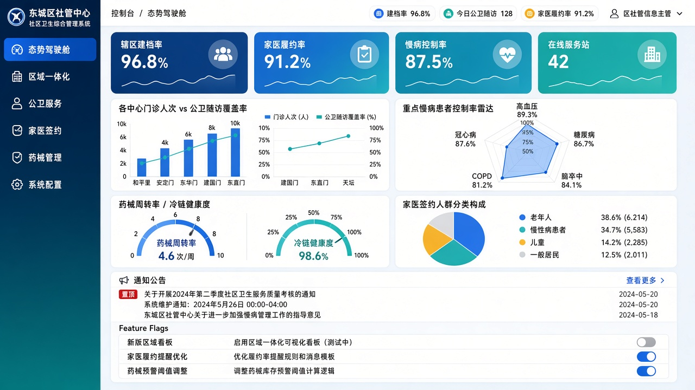

# 区社管中心社区卫生服务综合管理系统

> 上线主域名: [https://26-bj-com-bid.softwarelink.net/](https://26-bj-com-bid.softwarelink.net/)  
> 项目代码仓库: [https://github.com/softwarelink-net/26-bj-com-bid](https://github.com/softwarelink-net/26-bj-com-bid)



---

## 部署与运行说明

### 环境要求
- Node.js >= 18.0.0
- npm >= 9.0.0 或 pnpm >= 8.0.0

### 安装依赖
```bash
npm install
```

### 本地运行
```bash
# 启动前端本地开发服务器 (纯前端运行，自动加载本地 SQLite 数据库文件)
npm run dev
```
启动完成后，在浏览器打开终端输出的本地开发服务器地址（如 `http://localhost:5173/`）即可体验完整系统。

### 演示账号一览
| 角色类型 | 登录账号 | 默认密码 | 角色标识 | 说明 |
| :--- | :--- | :--- | :--- | :--- |
| 系统超管 | `admin` | `Admin@2026` | `ROLE_SUPER_ADMIN` | 区社管中心信息化主管 / 架构师 |
| 中心主任 | `director` | `Director@2026` | `ROLE_CENTER_DIRECTOR` | 朝阳门社区卫生服务中心主任 |
| 基层医生 | `doctor` | `Doctor@2026` | `ROLE_STATION_DOCTOR` | 全科主治医师 / 家医签约负责人 |
| 院领导层 | `leader` | `Leader@2026` | `ROLE_DECISION_MAKER` | 区卫健委分管主任 / 决策长官 |

### 常用脚本一览
- `npm run dev`: 本地启动 Vite 高性能开发服务器
- `npm run build`: 前端生产构建打包并输出到 dist 纯静态目录
- `npm run preview`: 本地预览生产构建产物
- `npm run lint`: 执行代码规范检查与 TypeScript 类型校验

### 目录结构
```text
26-bj-com-bid/
├── docs/
│   └── assets/
│       └── dashboard-preview.png
├── public/
│   ├── data/
│   │   └── bjcom_database.sqlite
│   ├── sitemap.xml
│   └── favicon.ico
├── src/
│   ├── assets/
│   ├── components/
│   │   ├── common/
│   │   │   └── GlobalStickyBanner.vue
│   │   └── layout/
│   ├── layouts/
│   │   ├── AuthLayout.vue
│   │   └── MainLayout.vue
│   ├── router/
│   │   └── index.ts
│   ├── stores/
│   ├── utils/
│   │   └── sqljs-engine.ts
│   ├── views/
│   │   ├── auth/
│   │   ├── dashboard/
│   │   ├── regional-mgmt/
│   │   ├── public-health/
│   │   ├── family-doctor/
│   │   ├── pharmacy/
│   │   └── system/
│   ├── App.vue
│   └── main.ts
├── schema.sql
├── package.json
└── README.md
```

---

## 招标公告全文

### 1. 标题
区社管中心社区卫生服务综合管理系统建设项目招标公告

### 2. 项目发包方
北京市东城区社区卫生服务管理中心

### 3. 项目编号
11010126210200022537-XM001

### 4. 项目发布时间
2026-09-15 00:00:00

### 5. 关键词
北京市东城区社区卫生服务管理中心, 社区卫生服务系统, HIS解耦, 基本公卫服务, 家医签约, 11010126210200022537-XM001, 北京政府采购

### 6. 摘要
北京市东城区社区卫生服务管理中心委托北京国恒招标有限公司，对区社管中心社区卫生服务综合管理系统建设项目组织公开招标，预算金额与最高限价为2,011,200.00元。采购需求为建设综合管理信息系统，将非临床业务从HIS系统中剥离，涵盖区域一体化管理、公卫服务、家医签约、药械管理及数据迁移，合同签订后6个月内完成项目建设，终验后提供2年免费运维服务，不接受联合体投标，投标文件递交截止时间为2026年10月09日09:00。

### 7. 技术要点
- **非临床业务自既有 HIS 系统中的无损剥离与松耦合架构重构**：提升底层医疗 HIS 运行效能。
- **区-中心-站科-医务四级分级业务管理与区域一体化指标统计**：实现多维数据精准汇聚。
- **居民电子健康档案、基本公卫、家医签约与药械全链条闭环**：保障基层医疗卫生高质量发展。
- **纯前端 WebAssembly sql.js 边缘极速响应体系**：零服务器常驻运维开销，数据本地极简持久化。

### 8. 技术创新性
- **全要素首都核心区社区卫生服务与公卫运营数字孪生指挥大屏**：宏观洞察各中心门诊流向、慢病控制率与家医签约履约率。
- **统一业务命名空间严格隔离架构**：统一采用专用数据表前缀与独立本地存储载体，杜绝同平台跨站点污染。

---

## 免责声明

1. **数据来源与合规性**：本项目所涉数据信息均采集自互联网公开渠道发布的标讯公示信息。项目开发者严格遵守《中华人民共和国数据安全法》及相关法律法规，确保数据来源合法、公开、可查询。
2. **技术实现路径**：本项目核心内容系基于国产大语言模型进行算法推演与自动化构造生成，非直接引用或复制原始招标文件。
3. **保密承诺**：本项目郑重承诺：不涉及、不包含任何国家秘密、商业秘密或未公开的敏感信息。所有生成内容均基于公开数据的逻辑推演。
4. **知识产权与巧合声明**：鉴于本项目内容均由AI模型基于公开数据推演生成，若生成内容在表述方式、结构逻辑上与任何第三方原始标书文件存在相似之处，纯属技术通用设计之巧合，不构成对任何第三方著作权的侵犯或商业秘密的泄露。本项目不保证生成内容的准确性与完整性，仅供技术研究与学习参考。
5. **免责条款**：任何单位或个人使用本项目代码及生成内容所产生的一切后果，均由使用者自行承担，项目开发者不承担任何法律责任。
